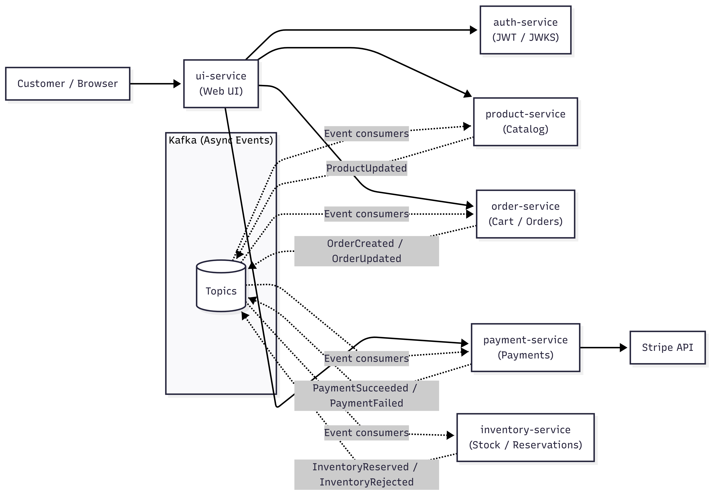
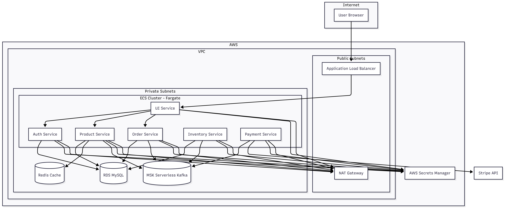
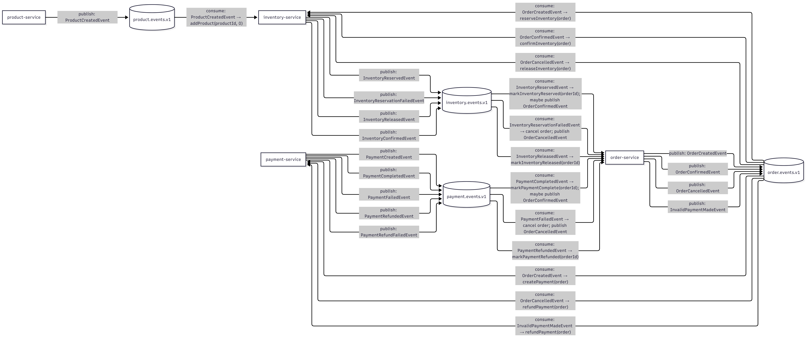

# Product Orders Platform

A microservice-based e-commerce platform built with Spring Boot. It supports:

- Product Management
- Order Processing
- JWT Authentication with JWKS URI
- Stripe Payment Processing
- Kafka Asynchronous Communication

## Architecture

### Microservices

### AWS Deployment

## Services

| Service           | Port | Description        |
|-------------------|------|--------------------|
| ui-service        | 8085 | Web UI             |
| auth-service      | 8083 | JWT authentication |
| product-service   | 8082 | Product catalog    |
| order-service     | 8081 | Order management   |
| inventory-service | 8086 | Stock management   |
| payment-service   | 8088 | Payment processing |

## Tech Stack

Backend:

- Java 17
- Spring Boot 4
- Spring Security
- Spring Data JPA
- Flyway
- MySQL

Infrastructure:

- Docker
- Docker Compose
- AWS ECS
- AWS MSK Serverless
- AWS RDS
- Redis

Messaging:

- Apache Kafka

Payments:

- Stripe

## Running the Project Locally

Start the system using `docker-compose up build`.

Services:

- Auth Service: http://localhost:8083
- Product Service: http://localhost:8082
- Order Service: http://localhost:8081
- Inventory Service: http://localhost:8086
- Payment Service: http://localhost:8088
- UI: http://localhost:8085

## Authentication

This platform uses **JWT (JSON Web Tokens)** for authentication. The **auth-service** issues signed JWTs, and other
services validate them using the auth-service’s **JWKS (JSON Web Key Set)** endpoint.

### Key pieces

- **Token issuer:** `auth-service` (port `8083`)
- **Public keys (JWKS):** `GET http://auth-service:8083/.well-known/jwks.json`
- **Clients send tokens as:** `Authorization: Bearer <JWT>`
- **Services validate tokens as resource servers:** they fetch public keys from the JWKS URI and verify token signatures
  locally.

### Login / request flow

1. A user registers or logs in via the UI:
    - `POST /api/auth/register` (public)
    - `POST /api/auth/login` (public)
2. On successful login, **auth-service returns a JWT** (access token).
3. The UI (browser) includes the JWT on subsequent requests in the `Authorization` header.
4. Services validate the token by downloading (and caching) the JWKS from `/.well-known/jwks.json`, then verifying:
    - JWT signature (using the correct public key, selected by `kid`)
    - expiry and other standard claims

## Environment Variables

Each service contains a .env file with environment variables. This is in .gitignore, but each service has a .env.example
file which lists all the variables.

## Deployment

Services run in ECS Fargate behind an ALB.
Each service has its own RDS database.
Redis is used for caching.
Kafka runs on a serverless MSK cluster.
Stripe is used for payments.
Secret environment variables are stored in Secrets Manager.

## Event Flow

## Shared Event Catalog (Order / Payment / Inventory)

Shared event contracts are defined in each service, along with other events:

- `order-service/src/main/java/**/messaging/event/*`
- `payment-service/src/main/java/**/messaging/event/*`
- `inventory-service/src/main/java/**/messaging/event/*`

### Cross-service conventions

- `eventId` (UUID): unique event identity (idempotency key)
- `orderId` (UUID): saga/business correlation key
- `occurredAt` (Instant): event timestamp (UTC)

### OrderCreatedEvent

Required fields:

- `eventId: UUID`
- `orderId: UUID`
- `totalAmountCents: long` (positive)
- `currency: String`
- `customerId: UUID`
- `customerEmail: String` (email)
- `customerAddress: String` (max 2000)
- `occurredAt: Instant`
- `items: List<OrderItem>` (non-empty)

### OrderConfirmedEvent

Required fields:

- `eventId: UUID`
- `orderId: UUID`
- `occurredAt: Instant`

### OrderCancelledEvent

Required fields:

- `eventId: UUID`
- `orderId: UUID`
- `reason: CancellationReason`
- `occurredAt: Instant`

### PaymentCreatedEvent

Required fields:

- `eventId: UUID`
- `orderId: UUID`
- `paymentId: UUID`
- `occurredAt: Instant`

### PaymentCompletedEvent

Required fields:

- `eventId: UUID`
- `orderId: UUID`
- `paymentId: UUID`
- `amountInCents: Long` (positive)
- `currency: String`
- `occurredAt: Instant`

### PaymentFailedEvent

Required fields:

- `eventId: UUID`
- `orderId: UUID`
- `reason: String`
- `occurredAt: Instant`

### PaymentRefundedEvent

Required fields:

- `eventId: UUID`
- `orderId: UUID`
- `occurredAt: Instant`

### InvalidPaymentMadeEvent

Required fields:

- `eventId: UUID`
- `orderId: UUID`
- `paymentId: UUID`
- `occurredAt: Instant`

### InventoryReservedEvent

Required fields:

- `eventId: UUID`
- `orderId: UUID`
- `occurredAt: Instant`

### InventoryReservationFailedEvent

Required fields:

- `eventId: UUID`
- `orderId: UUID`
- `reason: InventoryReservationFailedReason`
- `failureMessage: String`
- `occurredAt: Instant`

### InventoryReleasedEvent

Required fields:

- `eventId: UUID`
- `orderId: UUID`
- `occurredAt: Instant`

### InventoryConfirmedEvent

Required fields:

- `eventId: UUID`
- `orderId: UUID`
- `occurredAt: Instant`
